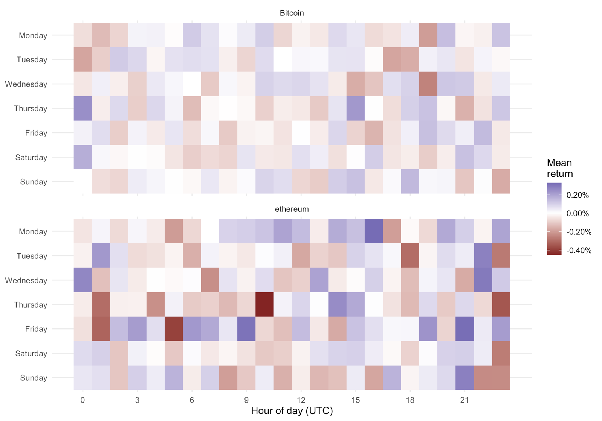
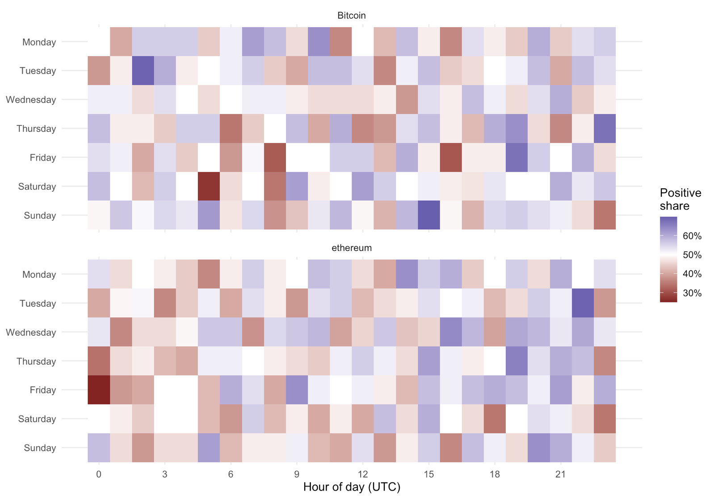
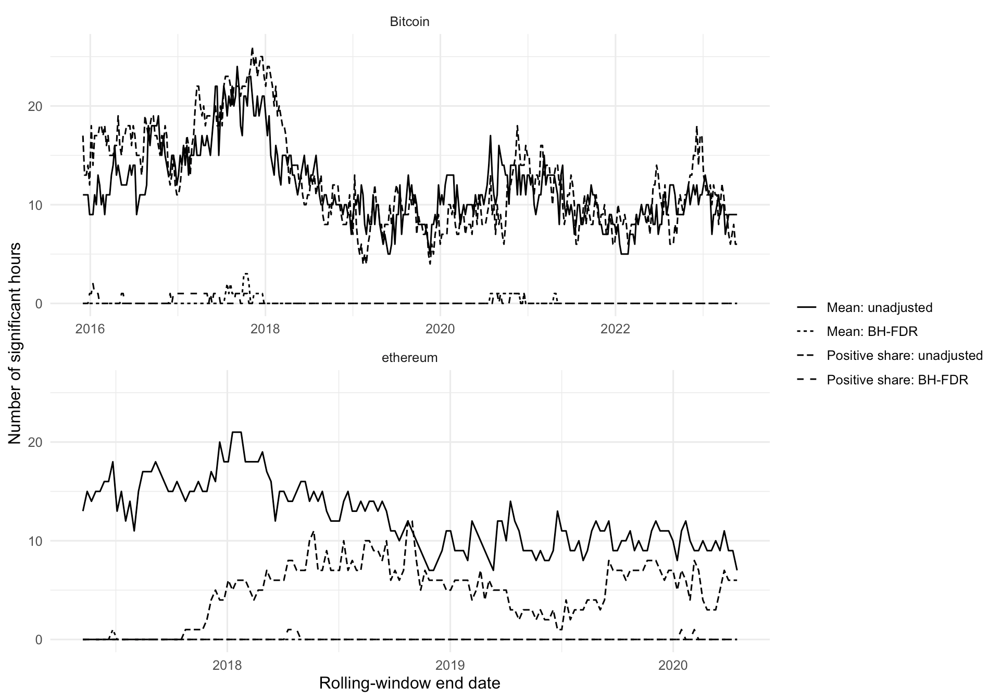

# Hourly Seasonality in Cryptocurrency Markets

### An empirical analysis of Bitcoin and Ethereum in R

This project examines whether cryptocurrency returns vary systematically across the **168 hours of a seven-day trading week**. Using hourly Bitcoin and Ethereum prices, it evaluates average log returns, the probability of positive returns, statistical significance across hour-of-week categories, and the stability of these patterns through rolling one-year windows.

The project is built in **R + Quarto** and emphasizes reproducible time-series analysis, careful treatment of irregular high-frequency data, multiple-hypothesis testing, and transparent interpretation of statistical evidence.

## Research questions

1. How do average log returns vary across the 168 hours of the week?
2. During which hours, if any, is the mean log return greater than zero?
3. During which hours, if any, does the probability of a positive return exceed 50%?
4. Are these patterns stable through trailing one-year windows?

## Data

Two historical price datasets are used:

- **Ethereum:** hourly prices from `ETH_1H.csv`.
- **Bitcoin:** one-minute prices from `coinbaseUSD_1-min_data.csv`, aggregated to hourly closing prices.

The raw datasets are not committed to the repository. Download instructions and source links are provided in [`data/README.md`](data/README.md).

### Data-quality rules

- Ethereum returns are retained only when adjacent observations are exactly one hour apart.
- Bitcoin hourly prices use the last available minute-level close within each hour.
- Bitcoin hours are retained only when their final observation occurs at minute 50 or later.
- The number of intrahour minute observations is otherwise not used as a filter because the analysis focuses on close-to-close hourly returns.
- Returns crossing nonconsecutive hourly timestamps are excluded for both assets.

## Methodology

For each asset, hourly log returns are calculated as

$$
r_t = \log\left(\frac{P_t}{P_{t-1}}\right).
$$

Each return is assigned to one of **168 weekday-hour categories** from Monday 00:00 UTC through Sunday 23:00 UTC.

The analysis then computes, for every hour of the week:

- mean log return;
- proportion of positive returns;
- a one-sided t-test of whether the mean return is greater than zero;
- a one-sided exact binomial test of whether the positive-return probability exceeds 50%; and
- Benjamini-Hochberg false-discovery-rate adjusted p-values.

A trailing **365-day rolling analysis**, evaluated every seven days, is used to assess whether the estimated hour-of-week effects persist through time. A minimum of 40 valid observations is required for a weekday-hour within a rolling window.

## Key results

In the most recent 365-day samples, several hour-specific effects are significant when assessed individually, but none survives the Benjamini-Hochberg adjustment at the 5% level.

| Asset | Mean return: raw p < 0.05 | Mean return: BH p < 0.05 | Positive share: raw p < 0.05 | Positive share: BH p < 0.05 |
|---|---:|---:|---:|---:|
| Bitcoin | 8 | 0 | 7 | 0 |
| Ethereum | 7 | 0 | 6 | 0 |

The largest recent mean-return point estimates occur at:

- **Bitcoin — Thursday 00:00 UTC:** approximately **0.244%** mean hourly log return.
- **Ethereum — Monday 16:00 UTC:** approximately **0.326%** mean hourly log return.

These point estimates are descriptive rather than evidence of an immediately exploitable trading rule. Across the rolling samples, nominally significant hours vary materially through time, while multiple-testing-adjusted discoveries are far more limited.

## Visual results

### Mean return by weekday and hour



### Probability of a positive return



### Statistical significance through time



## Interpretation

The evidence is stronger for **time-varying descriptive seasonality** than for a stable hour-of-week anomaly. Individual hours can appear statistically interesting in a particular sample, but the evidence weakens when the broader search across 168 hourly categories is taken into account. The rolling analysis also shows that the location and strength of apparent effects change over time.

The analysis therefore separates three levels of evidence:

1. **Descriptive seasonality** — differences in estimated returns across hours.
2. **Individual-hour significance** — whether a particular hour clears a conventional significance threshold.
3. **Multiple-testing robustness** — whether that evidence remains unusual after accounting for the many hypotheses examined simultaneously.

## Project structure

```text
hourly-crypto-seasonality/
├── README.md
├── hourly_crypto_seasonality.qmd
├── hourly-crypto-seasonality.Rproj
├── LICENSE
├── .gitignore
├── assets/
│   ├── mean-return-heatmap.png
│   ├── positive-return-heatmap.png
│   └── rolling-significance.png
└── data/
    └── README.md
```

## How to run the analysis

### 1. Clone the repository

```bash
git clone <YOUR-REPOSITORY-URL>
cd hourly-crypto-seasonality
```

### 2. Download the raw data

Follow the instructions in [`data/README.md`](data/README.md) and place both CSV files in `data/`.

### 3. Install the R packages

```r
install.packages(c(
  "data.table",
  "lubridate",
  "ggplot2",
  "scales",
  "knitr"
))
```

You will also need [Quarto](https://quarto.org/) installed.

### 4. Render the report

From a terminal:

```bash
quarto render hourly_crypto_seasonality.qmd
```

or open the `.qmd` file in RStudio and click **Render**.

## Tools and skills demonstrated

- R programming
- Quarto reproducible reporting
- high-frequency financial data cleaning
- time-series transformation
- log-return construction
- hypothesis testing
- multiple-comparison adjustment
- rolling-window analysis
- data visualization with `ggplot2`
- empirical interpretation and reproducibility

## Limitations

This project studies statistical return patterns rather than a fully specified trading strategy. It does not incorporate transaction costs, bid-ask spreads, slippage, market depth, or execution latency. The one-sample t-test can also be sensitive to heavy-tailed return distributions, and the analysis remains in-sample. A natural extension would test candidate patterns on unseen data and evaluate performance after realistic trading frictions.

## Author

**Rabbi Tweneboah, Robert Quainor, and Richmond Addai**

